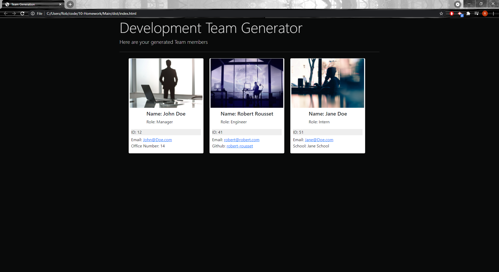

# 10 Object-Oriented Programming: Team Profile Generator

## My Task

If I'm being honest, I really struggled with the latter half of this task. 
I started strong with what I knew and developed the inquirer.prompt questions and general structure that it needed to have one prompt lead to the next prompts from the selection list. Once I completed this I started developing my tests and writing out the classes, making sure to test one element, then write the code and re-iterate until all tests passed and the classes were fully function with all parameters and methods added. I then used the input from the inquirer prompts, and created either the manager, engineer or intern objects out of this input. 

Then came the part I struggled with, using these objects to create HTML, and combining them at the end. I first tried by creating a "generateHtml" module, which I had a few switch() statements to decide which employee card to generate, but when doing this I couldn't figure out how to keep transfer the information from the object/inquirer inputs over to the module for it to generate the html and give it back to the html. I kept getting messages like employee.getRole() is not a function and eventually settled with generating all the HTML in the index.js file, which I admit isn't the nicest looking or most organised way of doing it, but from here I could easily create a different card after each prompt, and then the information could be transfered over easily. I then stored all the card HTML into an array which I could then use at the end to create all the HTML at once when the fs.writeFile(function) is called. 

## Links and Screenshots

Here is my walkthrough video: https://drive.google.com/file/d/1dlu4ppCKBMV0YgvvHR4B8NF7-eyUtCXb/view

The link to my generated [HTML](./Main/dist/index.html)

And a screenshot of my working application: 

Screenshot of passing Tests: 

